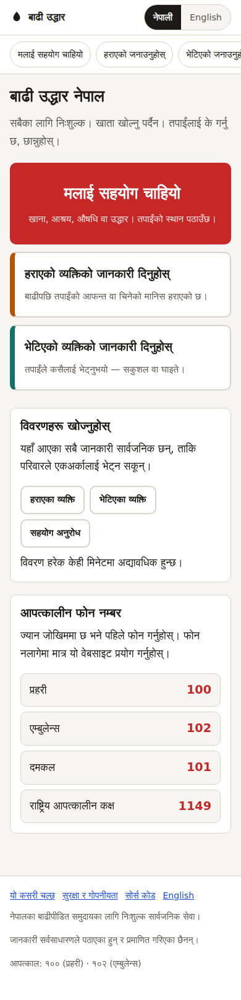
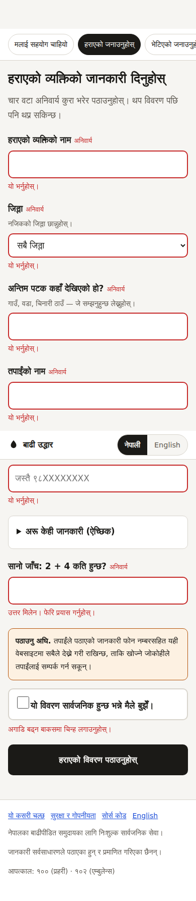

# Design notes

Answers to the five questions in the brief, plus the reasoning behind the
choices that are not obvious from the code.

---

## 1. Site structure

Nine pages, each existing twice — Nepali at the root, English under `/en`.

| Route | English route | What it is |
|-------|---------------|------------|
| `/` | `/en/` | Home: three big actions, emergency numbers |
| `/sos/` | `/en/sos/` | The SOS form |
| `/report-missing/` | `/en/report-missing/` | Report a missing person |
| `/report-found/` | `/en/report-found/` | Report a found person |
| `/missing/` | `/en/missing/` | Browse missing people |
| `/found/` | `/en/found/` | Browse found people |
| `/help/` | `/en/help/` | Browse help requests, list + map |
| `/safety/` | `/en/safety/` | What is public, and the risks of that |
| `/about/` | `/en/about/` | How the site works and what it cannot do |

**Why two URL sets instead of a JavaScript language switch.** A toggle that
swaps text in place gives both languages one URL, one `<title>` and no clean
`hreflang` — so Google indexes one of the two and the Nepali version, which is
the one most people need, is the one that tends to lose. Separate URLs cost
nothing at runtime (the pages are static files) and let each language be found
on its own terms.

Nepali is the default because the audience is Nepali. English is one tap away
and is remembered by the URL, not by a cookie.

---

## 2. How Google Forms and Sheets are wired in

Full instructions are in [`SETUP.md`](../SETUP.md). The short version:

**Writing.** Our own React form POSTs `application/x-www-form-urlencoded` to
`https://docs.google.com/forms/d/e/<formId>/formResponse` with Google's
`entry.<number>` field names. We do *not* embed Google's own form in an iframe:
that iframe is roughly half a megabyte, cannot be translated by our toggle, and
looks nothing like the rest of the site. On a 2G connection it is the difference
between a form that loads and one that does not.

**The catch, stated plainly.** Google sends no CORS headers on that endpoint, so
the POST is `mode: 'no-cors'` and the browser hands back an opaque response we
cannot read. A resolved promise means *the request left the phone*, not *Google
stored it*. The success screen is therefore worded to send people to the public
list to confirm, rather than promising the report is saved. This is the single
biggest technical compromise in the design, and it is the price of having no
backend at all.

**Reading.** Each Sheet is published via *File → Share → Publish to web → CSV*.
That endpoint does send `access-control-allow-origin: *`, so the listing pages
`fetch` it directly — no API key, no service account, no proxy. The CSV is
parsed with a hand-written RFC 4180 parser (`src/lib/csv.ts`) because people
type commas and newlines into "last seen location" constantly and a `split(',')`
would corrupt exactly the reports that matter.

Responses are cached for 60 seconds in memory, sorted newest-first, and rows
whose `Status` column says `spam`/`hide`/`duplicate` are dropped before render.

**Photos.** Google Forms' file upload requires the submitter to be signed in to a
Google account, which defeats the no-login requirement. Both person forms
therefore take a photo **link** instead. This is a real loss of functionality and
is the strongest argument for the Apps Script upgrade described in section 5.

---

## 3. Wireframes

These are screenshots of the running site at 390 px wide, not mockups.

| Homepage | Report a missing person |
|---|---|
|  |  |

The homepage puts the three actions in the order of how fast they matter: the
SOS button is red, full width and roughly twice the height of the others,
because someone opening this site on a roof should not have to read. Missing
(amber) and Found (teal) sit below as bordered cards. The same three colours
mark the cards on the listing pages, so a colour learned on the homepage keeps
meaning the same thing everywhere.

The forms show only required fields; everything optional is folded into a
collapsed "anything else" section. A missing-person report can be completed with
five taps and four short answers.

---

## 4. Spam prevention and safety

There is no server, so there is no server-side filter. The measures are layered
deliberately, weakest and cheapest first:

| Measure | Where | Notes |
|---|---|---|
| Honeypot field | All three forms | Hidden input; if filled, we show the success screen and send nothing, so a bot gets no signal to tune against |
| Time trap | Person forms only | A submission under 3 seconds is rejected. **Not** on the SOS form |
| Arithmetic check | Person forms only | "What is 2 + 4?" — no third-party CAPTCHA script, no extra bytes, reads the same in both languages, accepts Devanagari digits. **Not** on the SOS form |
| Rate limit | All three forms | 5 submissions per browser per 10 minutes, in `localStorage` |
| Moderation column | The Sheet | The actual defence: a human marks a row `spam` and it vanishes from the site |

**The SOS form is deliberately the least protected.** Someone asking to be
rescued gets a honeypot and a rate limit and nothing else — no puzzle, no delay,
no consent checkbox. Spam on that form is an annoyance; a rejected genuine SOS
is not.

**Privacy.** Exact GPS coordinates and phone numbers are published, per the
project decision to prioritise rescue speed. The consequences of that are stated
in plain language to the person before they send (on the form) and to everyone
else on the `/safety/` page: anyone can call the number, anyone can see the
location, and nobody legitimate will ask for money or bank details. If that
trade-off is ever revisited, `HelpCard` and `HelpMap` are the only two places
that render coordinates.

Reports are unverified by construction, and every listing page says so.

---

## 5. What changes if this outgrows Google Forms

In rough order of how soon you would hit each wall:

**1. Opaque submissions (hit immediately).** We cannot tell a person their report
saved. *Fix:* a Google Apps Script Web App (`doPost`) in front of the same Sheet.
It can return real JSON, so the UI can confirm, retry intelligently, and report
errors. Perhaps 40 lines of script; no other hosting.

**2. Photo uploads (hit within days).** Same Apps Script can accept a base64
image and write it to Drive, removing the "paste a link" workaround.

**3. Status updates ("this person was found", "this request is handled").** Needs
authenticated writes for volunteers. Apps Script with a shared secret is the
minimum; a real auth provider is the honest answer if more than a handful of
people moderate.

**4. Read volume.** The published CSV is served by Google's CDN and copes with a
lot, but every visitor downloads *every* row. Past a few thousand reports, move
reads to a scheduled job that writes a paginated, pre-filtered JSON blob to the
same static host. The site's fetch layer (`src/lib/sheets.ts`) is the only file
that changes.

**5. Real-time.** Nothing here is push-based. If seconds start to matter, this
architecture is the wrong one, and that is the point at which a small database
with a real API earns its keep.

Deliberately **not** recommended: jumping straight to a custom backend. Someone
has to keep it running during a disaster, and a Google Sheet that a volunteer
can open on their phone and edit by hand is worth more at 3 a.m. than a service
that needs a deploy.
